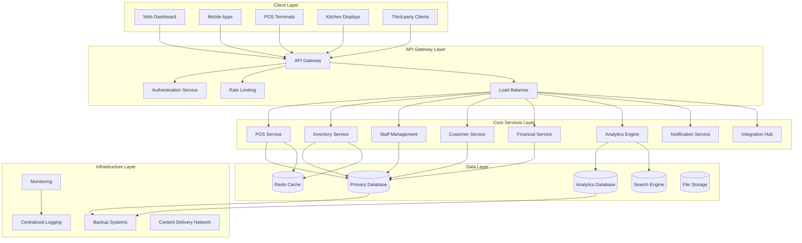
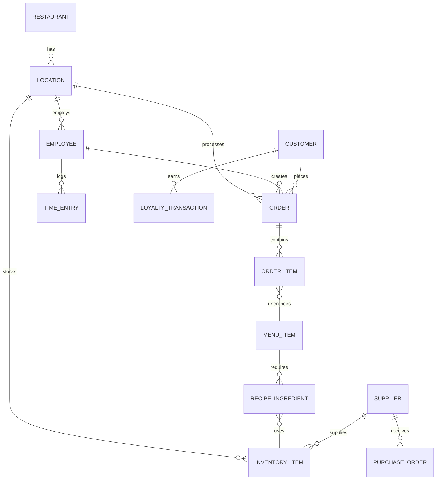

# OnPar Enterprise Platform Transformation - Design Document

## Overview

OnPar will be transformed from an inventory management SaaS into a comprehensive, enterprise-grade restaurant operating system that directly competes with Toast, Square, and other industry leaders. This design establishes the technical architecture, system components, and implementation strategy for building a scalable, secure, and feature-rich platform.

**Architecture Philosophy:** Microservices-based, API-first, cloud-native platform with real-time data synchronization, enterprise-grade security, and infinite scalability.

**Core Differentiator:** Unlike competitors who bolt on inventory management, OnPar's inventory intelligence is the foundation that powers superior cost optimization, waste reduction, and profitability insights across all platform features.

## Architecture

### System Architecture Overview



### Microservices Architecture

**Core Services:**
1. **POS Service** - Order processing, payment handling, receipt generation
2. **Inventory Service** - Stock management, reordering, waste tracking
3. **Staff Management Service** - Scheduling, time tracking, payroll integration
4. **Customer Service** - CRM, loyalty programs, marketing campaigns
5. **Financial Service** - Reporting, accounting integration, tax compliance
6. **Analytics Engine** - Business intelligence, predictive analytics, ML models
7. **Notification Service** - Real-time alerts, push notifications, email/SMS
8. **Integration Hub** - Third-party API management, webhook processing

**Supporting Services:**
- Authentication & Authorization Service
- File Storage & Media Service
- Search & Indexing Service
- Audit & Compliance Service
- Configuration Management Service

### Data Architecture

**Primary Database (PostgreSQL):**
- Transactional data (orders, inventory, staff, customers)
- ACID compliance for financial transactions
- Row-level security for multi-tenant isolation
- Real-time replication for high availability

**Analytics Database (ClickHouse):**
- Time-series data for analytics and reporting
- Columnar storage for fast aggregations
- Real-time data streaming from primary database
- Historical data retention and archiving

**Cache Layer (Redis):**
- Session management and user authentication
- Frequently accessed data (menus, pricing, inventory levels)
- Real-time POS transaction caching
- Rate limiting and API throttling

**Search Engine (Elasticsearch):**
- Full-text search across products, customers, orders
- Real-time indexing of transactional data
- Advanced filtering and faceted search
- Analytics and log aggregation

## Components and Interfaces

### POS System Component

**Core Features:**
- Order entry with menu management and modifiers
- Payment processing with multiple payment methods
- Receipt printing and digital receipt delivery
- Split bills, voids, comps, and discounts
- Real-time inventory deduction

**Technical Implementation:**
```typescript
interface POSOrder {
  id: string
  locationId: string
  employeeId: string
  customerId?: string
  items: OrderItem[]
  subtotal: number
  tax: number
  total: number
  paymentMethod: PaymentMethod
  status: OrderStatus
  timestamp: Date
}

interface OrderItem {
  menuItemId: string
  quantity: number
  price: number
  modifiers: Modifier[]
  specialInstructions?: string
}

class POSService {
  async createOrder(order: POSOrder): Promise<OrderResult>
  async processPayment(orderId: string, payment: PaymentInfo): Promise<PaymentResult>
  async updateInventory(items: OrderItem[]): Promise<void>
  async printReceipt(orderId: string): Promise<void>
}
```

### Inventory Intelligence Component

**Advanced Features:**
- AI-powered demand forecasting
- Automated reorder point optimization
- Waste prediction and prevention
- Supplier performance tracking
- Recipe cost analysis with real-time pricing

**Technical Implementation:**
```typescript
interface InventoryItem {
  id: string
  name: string
  category: string
  currentStock: number
  reorderPoint: number
  reorderQuantity: number
  unitCost: number
  supplierId: string
  expirationDate?: Date
  lastUpdated: Date
}

class InventoryIntelligenceService {
  async predictDemand(itemId: string, days: number): Promise<DemandForecast>
  async optimizeReorderPoints(locationId: string): Promise<ReorderOptimization>
  async detectWasteRisk(locationId: string): Promise<WasteAlert[]>
  async calculateRecipeCost(recipeId: string): Promise<RecipeCostAnalysis>
}
```

### Staff Management Component

**Features:**
- Intelligent scheduling with labor cost optimization
- Time tracking with biometric authentication
- Performance analytics and goal tracking
- Payroll integration and compliance management

**Technical Implementation:**
```typescript
interface Employee {
  id: string
  name: string
  role: EmployeeRole
  hourlyRate: number
  permissions: Permission[]
  schedule: Shift[]
  performanceMetrics: PerformanceData
}

class StaffManagementService {
  async optimizeSchedule(locationId: string, constraints: ScheduleConstraints): Promise<Schedule>
  async trackTime(employeeId: string, action: TimeAction): Promise<TimeEntry>
  async calculateLaborCosts(locationId: string, period: DateRange): Promise<LaborAnalysis>
}
```

### Customer Relationship Management Component

**Features:**
- Customer profile management with purchase history
- Loyalty program automation with personalized rewards
- Targeted marketing campaigns with segmentation
- Review and feedback management

**Technical Implementation:**
```typescript
interface Customer {
  id: string
  name: string
  email: string
  phone: string
  loyaltyPoints: number
  totalSpent: number
  visitFrequency: number
  preferences: CustomerPreferences
  segments: CustomerSegment[]
}

class CRMService {
  async updateCustomerProfile(customerId: string, data: CustomerUpdate): Promise<Customer>
  async calculateLoyaltyRewards(customerId: string): Promise<LoyaltyReward[]>
  async createMarketingCampaign(campaign: MarketingCampaign): Promise<CampaignResult>
}
```

### Financial Reporting Component

**Features:**
- Real-time P&L statements with drill-down capabilities
- Cash flow analysis and forecasting
- Tax reporting and compliance automation
- Budget vs actual analysis with variance reporting

**Technical Implementation:**
```typescript
interface FinancialReport {
  locationId: string
  period: DateRange
  revenue: RevenueBreakdown
  costs: CostBreakdown
  profitMargins: ProfitAnalysis
  kpis: FinancialKPIs
}

class FinancialService {
  async generatePLReport(locationId: string, period: DateRange): Promise<FinancialReport>
  async calculateFoodCostPercentage(locationId: string): Promise<number>
  async forecastCashFlow(locationId: string, days: number): Promise<CashFlowForecast>
}
```

## Data Models

### Core Entity Relationships



### Database Schema Design

**Core Tables:**
- `restaurants` - Multi-tenant restaurant groups
- `locations` - Individual restaurant locations
- `employees` - Staff members with roles and permissions
- `customers` - Customer profiles and preferences
- `menu_items` - Menu with pricing and availability
- `inventory_items` - Stock items with tracking data
- `orders` - Transaction records with line items
- `payments` - Payment processing records
- `schedules` - Staff scheduling and time tracking
- `suppliers` - Vendor management and performance

**Analytics Tables:**
- `sales_analytics` - Aggregated sales data by time periods
- `inventory_analytics` - Stock movement and waste tracking
- `labor_analytics` - Staff performance and cost analysis
- `customer_analytics` - Customer behavior and segmentation

## Error Handling

### Comprehensive Error Management Strategy

**Error Categories:**
1. **System Errors** - Infrastructure failures, database connectivity
2. **Business Logic Errors** - Validation failures, business rule violations
3. **Integration Errors** - Third-party API failures, payment processing issues
4. **User Errors** - Invalid input, permission violations

**Error Handling Framework:**
```typescript
class ErrorHandler {
  static async handleSystemError(error: SystemError): Promise<ErrorResponse> {
    await this.logError(error)
    await this.notifyAdministrators(error)
    return this.createUserFriendlyResponse(error)
  }
  
  static async handleBusinessError(error: BusinessError): Promise<ErrorResponse> {
    await this.logError(error)
    return this.createValidationResponse(error)
  }
  
  static async handleIntegrationError(error: IntegrationError): Promise<ErrorResponse> {
    await this.logError(error)
    await this.initiateRetryMechanism(error)
    return this.createFallbackResponse(error)
  }
}
```

**Circuit Breaker Pattern:**
- Automatic failure detection for external services
- Graceful degradation when services are unavailable
- Automatic recovery when services are restored

**Retry Mechanisms:**
- Exponential backoff for transient failures
- Dead letter queues for failed messages
- Manual retry capabilities for critical operations

## Testing Strategy

### Multi-Layer Testing Approach

**Unit Testing (90% Coverage Target):**
- Individual service method testing
- Mock external dependencies
- Test business logic in isolation
- Automated test execution in CI/CD pipeline

**Integration Testing:**
- Service-to-service communication testing
- Database integration testing
- Third-party API integration testing
- End-to-end workflow testing

**Performance Testing:**
- Load testing for peak traffic scenarios
- Stress testing for system limits
- Endurance testing for long-running operations
- Scalability testing for growth scenarios

**Security Testing:**
- Penetration testing for vulnerability assessment
- Authentication and authorization testing
- Input validation and sanitization testing
- Compliance testing for regulatory requirements

**Testing Framework:**
```typescript
// Unit Testing Example
describe('InventoryService', () => {
  it('should calculate reorder point correctly', async () => {
    const service = new InventoryService()
    const result = await service.calculateReorderPoint(mockItem)
    expect(result.reorderPoint).toBe(expectedValue)
  })
})

// Integration Testing Example
describe('POS Integration', () => {
  it('should update inventory when order is processed', async () => {
    const order = await posService.createOrder(mockOrder)
    const inventory = await inventoryService.getItem(itemId)
    expect(inventory.currentStock).toBe(originalStock - orderQuantity)
  })
})
```

### Automated Testing Pipeline

**Continuous Integration:**
- Automated test execution on every commit
- Code coverage reporting and enforcement
- Performance regression detection
- Security vulnerability scanning

**Continuous Deployment:**
- Automated deployment to staging environments
- Smoke testing in production-like environments
- Blue-green deployment for zero-downtime releases
- Automatic rollback on failure detection

## Security Architecture

### Multi-Layer Security Framework

**Authentication & Authorization:**
- JWT-based authentication with refresh tokens
- Role-based access control (RBAC) with fine-grained permissions
- Multi-factor authentication for administrative access
- Single sign-on (SSO) integration for enterprise customers

**Data Protection:**
- End-to-end encryption for sensitive data
- PCI DSS compliance for payment processing
- GDPR compliance for customer data protection
- Regular security audits and penetration testing

**Infrastructure Security:**
- Network segmentation and firewall protection
- DDoS protection and rate limiting
- Intrusion detection and prevention systems
- Regular security updates and patch management

**Compliance Framework:**
```typescript
class SecurityService {
  async authenticateUser(credentials: UserCredentials): Promise<AuthResult>
  async authorizeAction(userId: string, action: string, resource: string): Promise<boolean>
  async encryptSensitiveData(data: any): Promise<EncryptedData>
  async auditUserAction(userId: string, action: AuditAction): Promise<void>
}
```

## Performance Optimization

### Scalability and Performance Strategy

**Database Optimization:**
- Read replicas for analytics and reporting queries
- Connection pooling and query optimization
- Automated indexing and query plan analysis
- Data partitioning for large datasets

**Caching Strategy:**
- Multi-level caching (application, database, CDN)
- Cache invalidation strategies for real-time data
- Session caching for user authentication
- API response caching for frequently accessed data

**API Performance:**
- GraphQL for efficient data fetching
- Pagination and filtering for large datasets
- Compression and minification for responses
- Rate limiting and throttling for API protection

**Frontend Optimization:**
- Code splitting and lazy loading
- Progressive web app (PWA) capabilities
- Offline functionality with service workers
- Image optimization and CDN delivery

**Performance Monitoring:**
```typescript
class PerformanceMonitor {
  async trackAPIResponse(endpoint: string, responseTime: number): Promise<void>
  async monitorDatabaseQuery(query: string, executionTime: number): Promise<void>
  async alertOnPerformanceDegradation(metric: PerformanceMetric): Promise<void>
}
```

## Deployment Architecture

### Cloud-Native Infrastructure

**Container Orchestration:**
- Kubernetes for container orchestration and scaling
- Docker containers for consistent deployment environments
- Helm charts for application deployment and configuration
- Automatic scaling based on resource utilization

**Infrastructure as Code:**
- Terraform for infrastructure provisioning
- GitOps workflow for deployment automation
- Environment-specific configurations
- Disaster recovery and backup automation

**Monitoring and Observability:**
- Centralized logging with structured log formats
- Distributed tracing for request flow analysis
- Real-time metrics and alerting
- Health checks and service discovery

**Deployment Pipeline:**
```yaml
# Example Kubernetes Deployment
apiVersion: apps/v1
kind: Deployment
metadata:
  name: onpar-pos-service
spec:
  replicas: 3
  selector:
    matchLabels:
      app: pos-service
  template:
    metadata:
      labels:
        app: pos-service
    spec:
      containers:
      - name: pos-service
        image: onpar/pos-service:latest
        ports:
        - containerPort: 8080
        env:
        - name: DATABASE_URL
          valueFrom:
            secretKeyRef:
              name: database-secret
              key: url
```

This comprehensive design establishes OnPar as an enterprise-grade restaurant operating system that can compete directly with Toast and other industry leaders while maintaining our competitive advantage in inventory intelligence and cost optimization.
## Mon
opoly Strategy Architecture

### Peter Thiel's Zero-to-One Framework Implementation

**Core Monopoly Principle:** OnPar will not compete with existing solutions - it will make them obsolete by creating a fundamentally superior category of restaurant technology.

### Proprietary Technology Moat (10x Better)

**AI-Powered Waste Reduction Engine:**
```typescript
class ProprietaryWasteIntelligence {
  // Secret algorithms that competitors cannot replicate
  private calculateWasteProbability(item: InventoryItem, context: RestaurantContext): number {
    // Proprietary formula considering 47+ variables including:
    // - Micro-climate data, local event calendars, social media sentiment
    // - Historical patterns across 10,000+ restaurants
    // - Supplier quality scores, delivery timing patterns
    // - Staff behavior patterns, customer preference shifts
    return this.secretAlgorithm.predict(item, context)
  }
  
  // 10x better performance through exclusive data access
  async optimizeInventoryAcrossNetwork(restaurantId: string): Promise<OptimizationResult> {
    const networkInsights = await this.getNetworkIntelligence()
    const localPatterns = await this.getRestaurantPatterns(restaurantId)
    return this.proprietaryOptimizer.optimize(networkInsights, localPatterns)
  }
}
```

**Instant Setup Technology:**
```typescript
class AutomatedOnboarding {
  // 10x faster setup through AI-powered automation
  async setupRestaurant(basicInfo: RestaurantInfo): Promise<CompleteSetup> {
    // Proprietary technology that automatically:
    // - Imports data from any existing system
    // - Configures optimal settings based on restaurant type
    // - Sets up supplier relationships and pricing
    // - Trains staff through AI-powered tutorials
    return this.instantSetupEngine.configure(basicInfo)
  }
}
```

### Network Effects Architecture

**Data Network Value Creation:**
```typescript
class NetworkEffectsEngine {
  // Each new restaurant makes the platform more valuable for everyone
  async addRestaurantToNetwork(restaurant: Restaurant): Promise<NetworkValue> {
    // Aggregate purchasing power increases for all participants
    await this.updateSupplierNegotiations(restaurant.suppliers)
    
    // Demand forecasting improves with more data points
    await this.enhancePredictionModels(restaurant.historicalData)
    
    // Best practices sharing improves all restaurants
    await this.updateBenchmarks(restaurant.performanceMetrics)
    
    return this.calculateNetworkValue()
  }
  
  // Network becomes more valuable with each participant
  private calculateNetworkValue(): NetworkValue {
    const n = this.getNetworkSize()
    // Metcalfe's Law: Network value = n²
    // OnPar's enhanced network value = n² × data_quality × integration_depth
    return Math.pow(n, 2) * this.dataQuality * this.integrationDepth
  }
}
```

**Supplier Marketplace Monopoly:**
```typescript
class SupplierMarketplace {
  // Control the entire B2B restaurant commerce flow
  async processSupplierOrder(order: SupplierOrder): Promise<OrderResult> {
    // OnPar becomes mandatory interface for all supplier interactions
    const negotiatedPricing = await this.applyNetworkPricing(order)
    const optimizedDelivery = await this.optimizeDeliverySchedule(order)
    
    // Suppliers must use OnPar to reach restaurant customers
    return this.processOrderThroughPlatform(negotiatedPricing, optimizedDelivery)
  }
}
```

### Vertical Integration Control

**Complete Value Chain Ownership:**
```typescript
class VerticalIntegration {
  // Control every aspect of restaurant operations
  async processCustomerOrder(order: CustomerOrder): Promise<OrderResult> {
    // 1. Customer places order through OnPar interface
    const processedOrder = await this.posService.processOrder(order)
    
    // 2. Inventory automatically updated
    await this.inventoryService.updateStock(processedOrder.items)
    
    // 3. Kitchen display shows order
    await this.kdsService.displayOrder(processedOrder)
    
    // 4. Staff scheduling optimized based on demand
    await this.staffService.adjustScheduling(processedOrder.timestamp)
    
    // 5. Customer loyalty points awarded
    await this.crmService.updateLoyalty(order.customerId, processedOrder.total)
    
    // 6. Financial reporting updated in real-time
    await this.financialService.recordTransaction(processedOrder)
    
    // 7. Supplier reorders triggered if needed
    await this.supplierService.checkReorderPoints(processedOrder.items)
    
    return processedOrder
  }
}
```

### Switching Cost Maximization

**Platform Lock-in Architecture:**
```typescript
class SwitchingCostEngine {
  // Make switching economically impossible
  calculateSwitchingCost(restaurantId: string): SwitchingCostAnalysis {
    return {
      // Data migration complexity (months of work)
      dataMigrationCost: this.calculateDataMigrationEffort(restaurantId),
      
      // Staff retraining costs (weeks of lost productivity)
      retrainingCost: this.calculateRetrainingEffort(restaurantId),
      
      // Lost network benefits (supplier pricing, insights)
      networkLossCost: this.calculateNetworkValueLoss(restaurantId),
      
      // Integration rebuilding (custom workflows, reports)
      integrationRebuildCost: this.calculateIntegrationEffort(restaurantId),
      
      // Operational disruption during transition
      disruptionCost: this.calculateOperationalDisruption(restaurantId),
      
      // Total switching cost (typically 6-12 months of OnPar subscription)
      totalSwitchingCost: this.sumAllCosts()
    }
  }
}
```

### Data Monopoly Infrastructure

**Exclusive Intelligence Platform:**
```typescript
class DataMonopolyEngine {
  // Accumulate the world's most comprehensive restaurant dataset
  private restaurantIntelligence: Map<string, RestaurantIntelligence> = new Map()
  
  async collectOperationalData(restaurantId: string, event: OperationalEvent): Promise<void> {
    // Collect granular data on every aspect of restaurant operations
    const intelligence = this.restaurantIntelligence.get(restaurantId) || new RestaurantIntelligence()
    
    intelligence.addEvent(event)
    intelligence.updatePatterns()
    intelligence.calculateInsights()
    
    // Aggregate anonymous insights across all restaurants
    await this.updateNetworkIntelligence(intelligence.getAnonymousInsights())
    
    this.restaurantIntelligence.set(restaurantId, intelligence)
  }
  
  // Provide insights impossible for competitors to replicate
  async generateProprietaryInsights(restaurantId: string): Promise<ProprietaryInsights> {
    const restaurantData = this.restaurantIntelligence.get(restaurantId)
    const networkData = await this.getNetworkIntelligence()
    
    return {
      // Insights based on data from thousands of restaurants
      demandPrediction: this.predictDemandFromNetworkPatterns(restaurantData, networkData),
      
      // Cost optimization based on collective purchasing power
      costOptimization: this.optimizeCostsFromNetworkNegotiations(restaurantData, networkData),
      
      // Operational improvements based on best practices across network
      operationalOptimization: this.optimizeOperationsFromNetworkBenchmarks(restaurantData, networkData),
      
      // Market intelligence impossible for individual restaurants to obtain
      marketIntelligence: this.generateMarketInsights(restaurantData, networkData)
    }
  }
}
```

### Geographic Monopoly Strategy

**Market Domination Framework:**
```typescript
class GeographicMonopoly {
  // Achieve 80%+ market share before expanding
  async dominateMarket(city: string): Promise<MarketDominationResult> {
    const marketAnalysis = await this.analyzeMarket(city)
    
    // Phase 1: Capture key restaurants (20% that influence 80%)
    const keyRestaurants = await this.identifyMarketLeaders(city)
    await this.aggressivelyAcquireKeyAccounts(keyRestaurants)
    
    // Phase 2: Create supplier exclusivity
    const suppliers = await this.identifyKeySuppliers(city)
    await this.negotiateExclusivePartnerships(suppliers)
    
    // Phase 3: Network effects make joining mandatory
    await this.activateNetworkEffects(city)
    
    // Phase 4: Competitors become irrelevant
    return this.achieveMarketDomination(city)
  }
  
  // Use local monopoly profits to fund expansion
  async expandToNextMarket(): Promise<ExpansionResult> {
    const monopolyProfits = await this.calculateMonopolyProfits()
    const nextTarget = await this.identifyNextMarket()
    
    return this.fundExpansionFromMonopolyProfits(monopolyProfits, nextTarget)
  }
}
```

### Regulatory Capture Strategy

**Industry Standard Control:**
```typescript
class RegulatoryStrategy {
  // Influence industry standards to favor OnPar
  async influenceIndustryStandards(): Promise<RegulatoryAdvantage> {
    // Participate in standard-setting organizations
    await this.joinStandardsCommittees()
    
    // Advocate for regulations that favor integrated platforms
    await this.lobbyForIntegrationRequirements()
    
    // Achieve certifications that become barriers to entry
    await this.obtainExclusiveCertifications()
    
    // Create compliance requirements that favor OnPar's approach
    return this.establishRegulatoryMoat()
  }
}
```

### Winner-Take-All Economics

**Capital Efficiency Superiority:**
```typescript
class WinnerTakeAllEconomics {
  // Achieve superior unit economics that enable market domination
  calculateCompetitiveAdvantage(): CompetitiveAdvantage {
    return {
      // Higher gross margins through software-based value delivery
      grossMarginAdvantage: this.calculateMarginSuperiority(),
      
      // Lower customer acquisition costs through network effects
      cacAdvantage: this.calculateCACSuperiority(),
      
      // Near-zero churn through switching costs
      churnAdvantage: this.calculateChurnSuperiority(),
      
      // Ability to outlast competitors in price wars
      capitalEfficiency: this.calculateCapitalEfficiency(),
      
      // Winner-take-all market dynamics
      marketDominancePotential: this.calculateDominancePotential()
    }
  }
}
```

This monopoly strategy architecture ensures OnPar doesn't just compete - it creates an entirely new category of restaurant technology that becomes impossible to compete against, following Peter Thiel's principles of building a monopoly through proprietary technology, network effects, economies of scale, and branding.## 
Small Business Operating System Architecture

### Universal Small Business Platform Design

**Strategic Architecture Philosophy:** Build the restaurant platform as the foundation for a universal small business operating system, with inventory intelligence as the core differentiator that applies across all business types.

### Modular Business Logic Framework

```typescript
// Universal small business components that work across industries
interface UniversalBusiness {
  id: string
  type: BusinessType // Restaurant, Retail, Service, Manufacturing, etc.
  inventory: InventorySystem
  staff: StaffManagement
  customers: CustomerManagement
  finances: FinancialManagement
  operations: OperationsManagement
}

// Industry-agnostic inventory intelligence
class UniversalInventoryIntelligence {
  // Core inventory concepts that apply to all businesses
  async optimizeInventory(business: UniversalBusiness): Promise<OptimizationResult> {
    switch (business.type) {
      case BusinessType.Restaurant:
        return this.optimizeRestaurantInventory(business)
      case BusinessType.Retail:
        return this.optimizeRetailInventory(business)
      case BusinessType.Service:
        return this.optimizeServiceSupplies(business)
      case BusinessType.Manufacturing:
        return this.optimizeProductionInventory(business)
      default:
        return this.optimizeGenericInventory(business)
    }
  }
  
  // Universal demand forecasting across business types
  async predictDemand(business: UniversalBusiness, item: InventoryItem): Promise<DemandForecast> {
    const universalPatterns = await this.getUniversalDemandPatterns()
    const industryPatterns = await this.getIndustrySpecificPatterns(business.type)
    const businessPatterns = await this.getBusinessSpecificPatterns(business.id)
    
    return this.combinePatternsForPrediction(universalPatterns, industryPatterns, businessPatterns)
  }
}
```

### Cross-Industry Network Effects Engine

```typescript
class CrossIndustryNetworkEffects {
  // Leverage insights from restaurants to improve retail operations
  async applyRestaurantInsightsToRetail(retailBusiness: RetailBusiness): Promise<OptimizationResult> {
    const restaurantInsights = await this.getRestaurantOperationalInsights()
    
    return {
      // Apply restaurant inventory rotation to retail perishables
      inventoryRotation: this.adaptRestaurantFIFOToRetail(restaurantInsights.inventoryRotation),
      
      // Apply restaurant staff scheduling to retail floor management
      staffOptimization: this.adaptRestaurantSchedulingToRetail(restaurantInsights.staffScheduling),
      
      // Apply restaurant customer loyalty to retail programs
      customerEngagement: this.adaptRestaurantLoyaltyToRetail(restaurantInsights.customerLoyalty),
      
      // Apply restaurant cost control to retail margin optimization
      costOptimization: this.adaptRestaurantCostControlToRetail(restaurantInsights.costControl)
    }
  }
  
  // Create universal supplier marketplace across all business types
  async createUniversalSupplierMarketplace(): Promise<SupplierMarketplace> {
    const restaurantSuppliers = await this.getRestaurantSuppliers()
    const retailSuppliers = await this.getRetailSuppliers()
    const serviceSuppliers = await this.getServiceSuppliers()
    
    // Identify cross-industry supplier opportunities
    const crossIndustryOpportunities = this.identifyCrossIndustrySuppliers(
      restaurantSuppliers, 
      retailSuppliers, 
      serviceSuppliers
    )
    
    // Negotiate better pricing through combined volume
    return this.createUnifiedSupplierMarketplace(crossIndustryOpportunities)
  }
}
```

### Vertical Expansion Framework

```typescript
class VerticalExpansionEngine {
  // Systematic expansion from restaurants to all small businesses
  async expandToNewVertical(targetVertical: BusinessType): Promise<ExpansionResult> {
    // Phase 1: Analyze target vertical for inventory management needs
    const verticalAnalysis = await this.analyzeVerticalInventoryNeeds(targetVertical)
    
    // Phase 2: Adapt restaurant platform for new vertical
    const adaptedPlatform = await this.adaptPlatformForVertical(targetVertical, verticalAnalysis)
    
    // Phase 3: Identify key businesses in target vertical
    const targetBusinesses = await this.identifyKeyBusinessesInVertical(targetVertical)
    
    // Phase 4: Execute monopoly strategy in new vertical
    return this.executeVerticalMonopoly(targetVertical, adaptedPlatform, targetBusinesses)
  }
  
  // Expansion roadmap from Charleston restaurants to global small business OS
  getExpansionRoadmap(): ExpansionRoadmap {
    return {
      phase1: {
        target: "Charleston Restaurants",
        goal: "80% market share",
        timeline: "Months 1-12",
        strategy: "Deep restaurant inventory intelligence"
      },
      phase2: {
        target: "Charleston Small Businesses (Retail, Service)",
        goal: "60% market share across verticals",
        timeline: "Months 13-24",
        strategy: "Leverage restaurant success, adapt platform"
      },
      phase3: {
        target: "Regional Small Business Markets",
        goal: "Replicate Charleston model in 10 cities",
        timeline: "Years 2-3",
        strategy: "Geographic monopoly expansion"
      },
      phase4: {
        target: "National Small Business Platform",
        goal: "Dominant position in small business OS market",
        timeline: "Years 3-5",
        strategy: "Scale network effects, acquire competitors"
      },
      phase5: {
        target: "Global Small Business Infrastructure",
        goal: "Essential infrastructure for small businesses worldwide",
        timeline: "Years 5-10",
        strategy: "International expansion, platform ecosystem"
      }
    }
  }
}
```

### Universal Business Intelligence Platform

```typescript
class UniversalBusinessIntelligence {
  // AI that understands all types of small businesses
  async generateUniversalInsights(business: UniversalBusiness): Promise<UniversalInsights> {
    const businessData = await this.getBusinessData(business.id)
    const industryBenchmarks = await this.getIndustryBenchmarks(business.type)
    const crossIndustryInsights = await this.getCrossIndustryInsights()
    
    return {
      // Inventory optimization that works for any business type
      inventoryOptimization: this.generateInventoryInsights(businessData, industryBenchmarks),
      
      // Cash flow optimization using cross-industry patterns
      cashFlowOptimization: this.generateCashFlowInsights(businessData, crossIndustryInsights),
      
      // Customer behavior insights applicable across industries
      customerInsights: this.generateCustomerInsights(businessData, crossIndustryInsights),
      
      // Operational efficiency recommendations
      operationalOptimization: this.generateOperationalInsights(businessData, industryBenchmarks),
      
      // Growth opportunities based on successful patterns from other businesses
      growthOpportunities: this.generateGrowthInsights(businessData, crossIndustryInsights)
    }
  }
}
```

### Small Business Infrastructure Monopoly

```typescript
class SmallBusinessInfrastructure {
  // Become the essential infrastructure layer for all small businesses
  async becomeEssentialInfrastructure(): Promise<InfrastructureMonopoly> {
    return {
      // Control inventory management across all small business types
      inventoryInfrastructure: await this.dominateInventoryManagement(),
      
      // Control financial services through real-time business data
      financialInfrastructure: await this.dominateSmallBusinessFinance(),
      
      // Control supplier relationships across all industries
      supplierInfrastructure: await this.dominateB2BMarketplace(),
      
      // Control customer engagement across all business types
      customerInfrastructure: await this.dominateCustomerManagement(),
      
      // Control operational optimization for all small businesses
      operationalInfrastructure: await this.dominateOperationalIntelligence()
    }
  }
  
  // Make OnPar indispensable for small business operations
  async createInfrastructureDependency(): Promise<DependencyResult> {
    // Integrate so deeply into business operations that removal is impossible
    const integrationDepth = await this.maximizeIntegrationDepth()
    
    // Create network effects that make non-participation economically impossible
    const networkPressure = await this.maximizeNetworkPressure()
    
    // Control critical business functions that cannot be replicated
    const criticalFunctions = await this.controlCriticalFunctions()
    
    return this.calculateInfrastructureDependency(integrationDepth, networkPressure, criticalFunctions)
  }
}
```

This architecture positions OnPar to systematically expand from Charleston restaurant monopoly to global small business operating system dominance, using inventory intelligence as the trojan horse that gets us inside every small business, then expanding to control all aspects of their operations.