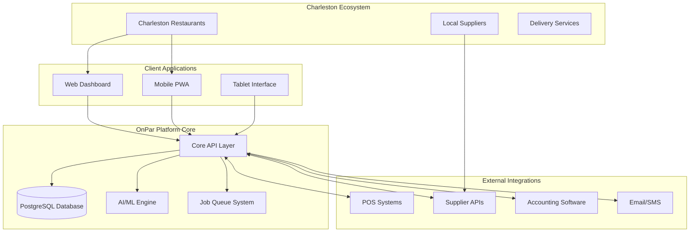

# OnPar Completion - Design Document

## Overview

OnPar's design philosophy centers on becoming the **inventory management operating system** for small businesses, starting with our Charleston restaurant monopoly. The architecture must support both immediate market domination and long-term platform expansion.

**Core Design Principles:**
- **Monopoly-First:** Every feature should strengthen our Charleston market position
- **Platform-Ready:** Architecture must support expansion to other small business verticals
- **Network Effects:** Design features that become more valuable as more businesses join
- **Supplier Integration:** Build the foundation for eventual supplier marketplace control
- **White-Glove Experience:** Premium service justifies premium pricing

## Architecture

### High-Level System Architecture



### Data Architecture for Platform Expansion

The database schema is designed to support multiple business types while maintaining restaurant-specific optimizations:

```sql
-- Core platform entities (business-agnostic)
businesses (id, type, name, location, subscription_tier)
users (id, business_id, role, permissions)
items (id, business_id, name, category, unit_type)
transactions (id, business_id, type, amount, timestamp)

-- Restaurant-specific extensions
restaurant_profiles (business_id, cuisine_type, seating_capacity, avg_covers)
menu_items (id, business_id, name, recipe_id, price)
recipes (id, business_id, name, instructions, yield)
recipe_ingredients (recipe_id, item_id, quantity)

-- Future vertical extensions (prepared for expansion)
retail_profiles (business_id, store_type, square_footage)
service_profiles (business_id, service_type, capacity)
```

## Components and Interfaces

### 1. AI-Powered Waste Reduction Engine

**Component:** `WasteReductionEngine`
**Purpose:** Deliver the promised 10-20% waste reduction through intelligent analysis

```typescript
interface WasteReductionEngine {
  analyzeWastePatterns(businessId: string): WasteAnalysis
  generateRecommendations(analysis: WasteAnalysis): ActionPlan[]
  trackImplementationResults(planId: string): ImpactMetrics
  benchmarkAgainstIndustry(businessId: string): BenchmarkReport
}

interface ActionPlan {
  id: string
  priority: 'high' | 'medium' | 'low'
  category: 'ordering' | 'storage' | 'preparation' | 'menu'
  description: string
  expectedSavings: number
  implementationSteps: string[]
  timeframe: string
}
```

### 2. White-Glove Onboarding System

**Component:** `OnboardingOrchestrator`
**Purpose:** Manage the $299 setup service that justifies premium pricing

```typescript
interface OnboardingOrchestrator {
  scheduleSetupVisit(businessId: string, preferences: SchedulingPreferences): SetupAppointment
  generateInventoryAuditPlan(businessId: string): AuditPlan
  trackSetupProgress(appointmentId: string): SetupProgress
  completeOnboarding(appointmentId: string, results: SetupResults): OnboardingCompletion
}

interface SetupAppointment {
  id: string
  businessId: string
  scheduledDate: Date
  estimatedDuration: number
  teamMembers: string[]
  equipmentNeeded: string[]
  preparationInstructions: string[]
}
```

### 3. Charleston Market Intelligence System

**Component:** `MarketIntelligence`
**Purpose:** Track and optimize our path to Charleston restaurant monopoly

```typescript
interface MarketIntelligence {
  trackMarketPenetration(): MarketPenetrationReport
  identifyProspects(): RestaurantProspect[]
  analyzeCompetitiveThreats(): CompetitiveAnalysis
  measureNetworkEffects(): NetworkEffectsMetrics
  planExpansionStrategy(): ExpansionPlan
}

interface MarketPenetrationReport {
  totalRestaurants: number
  onparCustomers: number
  penetrationRate: number
  targetSegments: MarketSegment[]
  growthOpportunities: string[]
}
```

### 4. Supplier Network Foundation

**Component:** `SupplierNetworkManager`
**Purpose:** Build the infrastructure for eventual supplier marketplace control

```typescript
interface SupplierNetworkManager {
  onboardSupplier(supplierData: SupplierProfile): Supplier
  aggregatePurchasingPower(): PurchasingPowerMetrics
  negotiateGroupPricing(itemCategories: string[]): PricingAgreement[]
  facilitateDirectOrdering(restaurantId: string, supplierId: string): OrderTransaction
  trackSupplierPerformance(supplierId: string): PerformanceMetrics
}

interface SupplierProfile {
  id: string
  name: string
  categories: string[]
  deliveryZones: string[]
  minimumOrders: Record<string, number>
  paymentTerms: string
  integrationCapabilities: string[]
}
```

### 5. Platform Extensibility Layer

**Component:** `PlatformCore`
**Purpose:** Enable rapid expansion to other small business verticals

```typescript
interface PlatformCore {
  registerBusinessType(type: BusinessType): void
  adaptFeatureSet(businessType: string, features: Feature[]): AdaptedFeatureSet
  deployToNewVertical(vertical: BusinessVertical): DeploymentPlan
  shareInsightsAcrossVerticals(): CrossVerticalInsights
}

interface BusinessVertical {
  name: string
  inventoryPatterns: InventoryPattern[]
  supplierTypes: string[]
  regulatoryRequirements: string[]
  keyMetrics: string[]
}
```

## Data Models

### Core Business Entity Model

```typescript
interface Business {
  id: string
  type: 'restaurant' | 'retail' | 'service' // Extensible for future verticals
  profile: RestaurantProfile | RetailProfile | ServiceProfile
  subscription: {
    tier: 'basic' | 'premium'
    monthlyFee: number
    setupFee: number
    features: string[]
  }
  location: {
    address: string
    city: string
    state: string
    coordinates: [number, number]
  }
  onboardingStatus: 'pending' | 'scheduled' | 'in_progress' | 'completed'
  marketIntelligence: {
    acquisitionChannel: string
    competitorAnalysis: string[]
    networkConnections: string[]
  }
}
```

### AI Insights Data Model

```typescript
interface AIInsight {
  id: string
  businessId: string
  type: 'waste_reduction' | 'cost_optimization' | 'demand_prediction'
  confidence: number
  impact: {
    estimatedSavings: number
    timeframe: string
    effort: 'low' | 'medium' | 'high'
  }
  recommendation: {
    title: string
    description: string
    actionSteps: string[]
    successMetrics: string[]
  }
  implementation: {
    status: 'pending' | 'in_progress' | 'completed' | 'dismissed'
    startDate?: Date
    completionDate?: Date
    actualResults?: ImpactMetrics
  }
}
```

## Error Handling

### Graceful Degradation Strategy

1. **Core Functionality First:** Basic inventory tracking must work even if AI features fail
2. **Offline Capability:** Mobile app must function without internet for critical operations
3. **Supplier Integration Fallbacks:** Manual processes when automated integrations fail
4. **Charleston-Specific Resilience:** Local backup systems for our core market

### Error Recovery Patterns

```typescript
interface ErrorRecoveryStrategy {
  // AI service failures
  handleAIServiceDown(): FallbackInsights
  
  // Supplier integration failures  
  handleSupplierAPIFailure(supplierId: string): ManualOrderProcess
  
  // Payment processing issues
  handlePaymentFailure(businessId: string): GracePeriodExtension
  
  // Onboarding service disruptions
  handleSetupDelays(appointmentId: string): CustomerCommunicationPlan
}
```

## Testing Strategy

### Charleston Market Validation

1. **Beta Restaurant Testing:** Validate features with our existing Charleston customer base
2. **Supplier Integration Testing:** Test with local Charleston suppliers before broader rollout
3. **White-Glove Service Testing:** Perfect the $299 setup process with real customers
4. **Market Penetration Testing:** A/B test different acquisition strategies in Charleston

### Platform Scalability Testing

1. **Multi-Tenant Architecture:** Ensure the platform can handle multiple business types
2. **Load Testing:** Simulate Charleston market saturation (500+ restaurants)
3. **Integration Testing:** Validate all external system integrations
4. **AI Performance Testing:** Ensure AI insights remain accurate at scale

### Business Model Validation

1. **Pricing Optimization:** Test different pricing tiers and upsell strategies
2. **Churn Prevention:** Identify and address reasons customers might leave
3. **Network Effects Measurement:** Quantify value creation as more businesses join
4. **Supplier Marketplace Readiness:** Test infrastructure for future marketplace launch

## Implementation Phases

### Phase 1: Charleston Monopoly Completion (Months 1-6)
- Complete AI waste reduction engine
- Perfect white-glove onboarding process
- Achieve 80%+ Charleston restaurant market penetration
- Build supplier network foundation

### Phase 2: Platform Foundation (Months 7-12)
- Implement extensible architecture for other business types
- Launch supplier marketplace beta
- Develop cross-business insights capabilities
- Prepare for geographic expansion

### Phase 3: Small Business OS Launch (Months 13-18)
- Expand to retail and service businesses in Charleston
- Launch in second geographic market
- Implement advanced AI across all business types
- Establish OnPar as the small business infrastructure standard

This design ensures OnPar becomes not just successful inventory software, but the foundational operating system that powers small business commerce - starting with our Charleston restaurant monopoly and expanding to become the Stripe of inventory management.