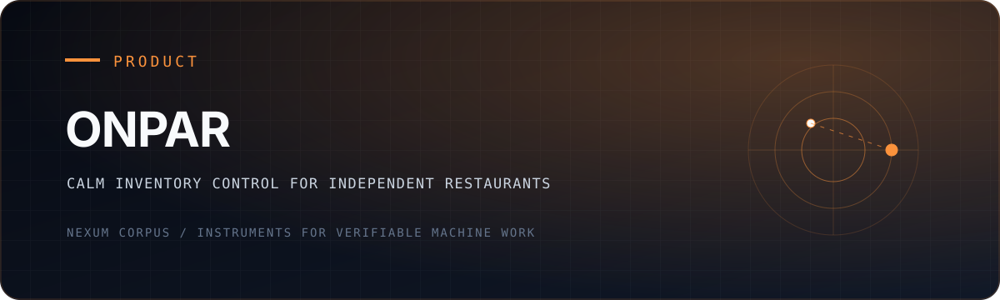

<div align="center">
  

  <p><strong>Know what is on hand, what it costs, what is being wasted, and what to order next.</strong></p>

  <p><a href="#product-surface">Product surface</a> · <a href="#local-setup">Local setup</a> · <a href="#verification">Verification</a> · <a href="https://github.com/NexumCorpus">Nexum Corpus</a></p>
</div>

---

OnPar is an operations system for independent restaurants. It brings inventory,
purchasing, suppliers, recipes, waste, analytics, and kitchen-facing workflows
into one calm interface so operators can spend less time reconciling spreadsheets
and more time acting on the numbers.

## The operating question

Restaurant inventory software often records yesterday. OnPar is organized around
the next decision:

- What is running low?
- What changed in cost?
- What should be purchased?
- Where is waste accumulating?
- Which recipes and suppliers are changing margin?
- What does the kitchen need to see right now?

## Product surface

| Surface | Purpose |
|---|---|
| Dashboard | Operational overview and priority signals |
| Inventory | Item-level stock visibility and intake |
| Purchasing | Purchase orders from draft through detail view |
| Suppliers | Vendor records and sourcing context |
| Recipes | Ingredient and costing relationships |
| Waste | Waste capture and trend visibility |
| Analytics | Measured operating patterns |
| Insights | Decision-oriented summaries |
| Kitchen | Focused kitchen-facing workflow |
| Onboarding and settings | Organization setup and configuration |

The repository also includes authentication, Stripe integration points,
Supabase-backed data access, Sentry instrumentation, responsive marketing pages,
and automated unit and end-to-end test surfaces.

## Local setup

Requirements: Node.js 20+, npm, and a Supabase project.

```bash
git clone https://github.com/NexumCorpus/OnParV2.git
cd OnParV2
npm install
copy .env.example .env.local
npm run dev
```

Configure the variables documented in [`.env.example`](./.env.example):

- Supabase URL, anonymous key, and service-role key
- Stripe publishable, secret, and webhook keys
- application URL
- optional Sentry and log-level settings

Then open [http://localhost:3000](http://localhost:3000).

## Verification

```bash
npm run type-check
npm run lint
npm test
npm run build
npm run test:e2e
```

These are separate gates: a green type-check does not imply the browser workflow
passes, and local tests do not establish that an external Supabase or Stripe
configuration is production-ready.

## Stack

- Next.js 16 and React 19
- TypeScript and Tailwind CSS
- Supabase authentication and data services
- Stripe billing integration
- Vitest and Playwright
- Sentry and structured logging

## Current posture

This repository contains the application and its deployment configuration. A
public hosted demo is not currently declared in the repository metadata, so the
README intentionally makes no uptime, customer-count, savings, or production
reliability claim.

## Portfolio

OnPar is the commercial product surface inside
[Nexum Corpus](https://github.com/NexumCorpus), an estate focused on verifiable
machine work. The research infrastructure is not required to run OnPar; the
shared principle is narrower: operational claims should be inspectable, and
software should say clearly what it has and has not proved.
